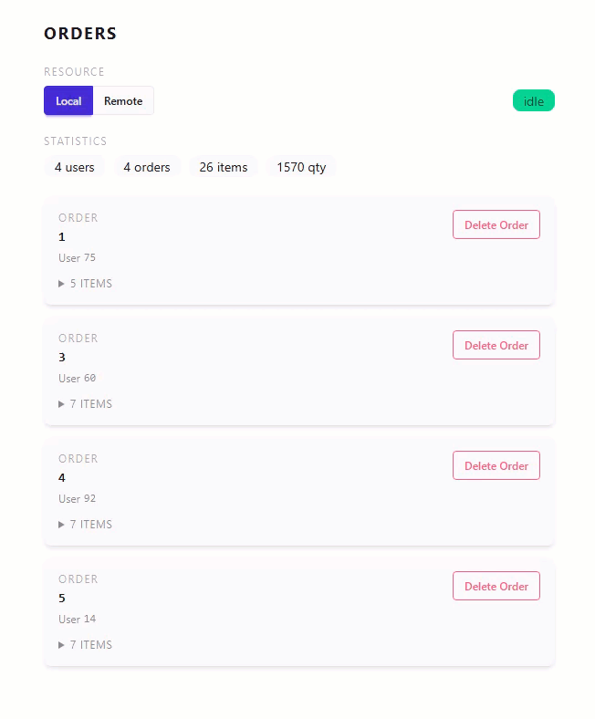
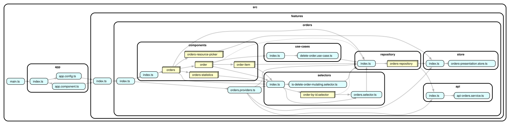

# Clean Reactive Architecture — Angular Sample

A sample application that demonstrates [Clean Reactive Architecture](https://github.com/clean-reactive/documentation/blob/main/docs/architecture.md) implemented with Angular and TanStack Query.

The sample shows a concrete, working mapping of every architectural unit from the diagram to idiomatic Angular code.

> **Architecture reference implementation.** `components/order`
> intentionally keeps every unit separate so the complete architecture is
> visible in one place. This is for understanding the boundaries and how a
> codebase may evolve, not a rule that every component must follow. Simpler
> components in this sample inline units that have no independent policy or
> reuse. See the
> [Development Methodology](https://github.com/clean-reactive/documentation/blob/main/docs/methodology.md)
> for the incremental approach behind these choices.



## Getting started

Install dependencies:

```sh
npm ci
```

Start the development server:

```sh
npm start
```

## Tech stack

- [Angular](https://angular.dev/) 21
- [TanStack Query](https://tanstack.com/query/latest) (`@tanstack/angular-query-experimental`)
- [TypeScript](https://www.typescriptlang.org/)
- [Tailwind CSS](https://tailwindcss.com/) + [daisyUI](https://daisyui.com/)
- [Vitest](https://vitest.dev/) + [Angular Testing Library](https://testing-library.com/docs/angular-testing-library/intro/)
- [MSW](https://mswjs.io/) for network-level HTTP interception in gateway tests
- [dependency-cruiser](https://github.com/sverweij/dependency-cruiser) for dependency validation and graph visualization

## Architecture mapping

The table below shows how each unit from the Clean Reactive Architecture diagram maps to this codebase.

| Architectural unit | Angular equivalent | Location |
| --- | --- | --- |
| Application business entity | Injectable class with Angular `signal` | `store/orders-presentation.store.ts` |
| Enterprise business entity | TypeScript type | `repository/orders-repository/orders.repository.types.ts` |
| Gateway interface | TypeScript interface + `InjectionToken` | `OrdersGateway` in `orders.gateway.ts` |
| Repository (gateway + entities) | Injectable class with TanStack Query | `repository/orders-repository/orders.repository.ts` |
| Gateway implementation | Injectable class implementing `OrdersGateway` | `InMemoryOrdersService`, `RemoteOrdersService` |
| Use case interactor | Injectable class or method on the interaction owner | `use-cases/delete-order.use-case.ts`, `components/order-item/order-item.component.ts` |
| Selector | Injectable class with `computed` | `selectors/order-by-id.selector`, `is-delete-order-mutating.selector.ts` |
| Presenter | Injectable class exposing ViewModels | `components/order/order.presenter.ts` |
| ViewModel | Value returned by each presenter property | `Presenter` properties in `components/order/order.types.ts` |
| Controller | Injectable class returning callbacks | `components/order/order.controller.ts` |
| User interface | Angular component | `components/orders`, `components/order`, `components/order-item` |

## Key design decisions

**Extracted units as Angular injectables.** Clean Reactive Architecture does not prescribe how units are implemented. In this sample, extracted units are implemented as injectable classes composed through Angular DI. `Order` deliberately extracts all of these units to demonstrate the fully decomposed architecture.

**Component classes as composition roots.** A component class composes the units used by its view, wires their dependencies through Angular DI, and exposes the presenter and controller surface to the template. Units do not need to be injectable when their behavior is local to that component.

**Self-contained Angular components.** Components in this sample own their view-facing behavior and resolve their data within their own composition boundary. Their inputs are limited to identity or configuration, such as `orderId` and `itemId`, rather than receiving data through inputs. This is a deliberate demonstration choice, not a mandatory rule, it demonstrates how to reduce structural coupling.

**Context API for scoped data.** A context makes a value available within a component's DI scope. The `Order` component provides its reactive `orderId` once, and each unit created in that scope can read it from context. This avoids passing `orderId` to every unit manually or coupling those units to the `Order` component. The mental model is React's `<Context.Provider value={...}>` and `useContext`.

**Application business entity as an Angular signal-based class.** `OrdersPresentationStore` holds application-level state (`ordersResource: "local" | "remote"`) that persists across use case calls and has its own rules. It is managed by a dedicated injectable class backed by Angular signals, not by TanStack Query.

**Repository as a TanStack Query injectable class.** The `OrdersRepository` is a composite of the gateway interface and the enterprise business entity. It exposes `OrdersGateway` behaviour through `injectQuery` / `injectMutation` calls and owns the entity cache that presenters and selectors read from.

**Gateway implementations resolved at runtime via Angular DI.** `I_ORDERS_GATEWAY` is an `InjectionToken` that is provided with either `InMemoryOrdersService` or `RemoteOrdersService` depending on the `ordersResource` value stored in the application business entity. The active implementation can change without any structural change to the architecture.

**Signals for reactive state.** Selectors and presenters expose their results as Angular `Signal` / `computed` values, enabling fine-grained reactive updates without RxJS streams.

## UML diagram representing application architecture


## Folder structure

```console
src/features
└── orders
    ├── api                         # external resource (HTTP client + API)
    │   ├── api-orders-dto.factory.ts
    │   ├── api-orders.service.ts
    │   └── types.ts
    ├── components                  # user interface, presenters, controllers
    │   ├── order
    │   │   ├── order.component.ts
    │   │   ├── order.component.html
    │   │   ├── order.context.ts
    │   │   ├── order.controller.ts
    │   │   ├── order.presenter.ts
    │   │   └── order.types.ts
    │   ├── order-item
    │   │   ├── order-item.component.ts
    │   │   └── order-item.component.html
    │   ├── orders
    │   │   ├── orders.component.ts
    │   │   └── orders.component.html
    │   ├── orders-resource-picker
    │   │   └── orders-resource-picker.component.ts
    │   └── orders-statistics
    │       └── orders-statistics.component.ts
    ├── repository                  # repository, gateway interface, gateway implementations
    │   └── orders-repository
    │       ├── orders-service
    │       │   ├── in-memory-orders-service
    │       │   │   ├── in-memory-orders.service.ts
    │       │   │   └── order-entity.factory.ts
    │       │   ├── orders.service.ts
    │       │   └── remote-orders-service
    │       │       └── remote-orders.service.ts
    │       ├── orders.repository.ts
    │       └── orders.repository.types.ts
    ├── selectors                   # selectors
    │   ├── is-delete-order-mutating.selector.ts
    │   ├── order-by-id.selector
    │   │   └── order-by-id.selector.ts
    │   └── orders.selector.ts
    ├── store                       # application business entity
    │   └── orders-presentation.store.ts
    ├── use-cases                   # use case interactors
    │   └── delete-order.use-case.ts
    ├── orders.providers.ts
    └── test-ids.ts
```

## Further reading

- [Clean Reactive Architecture](https://github.com/clean-reactive/documentation/blob/main/docs/architecture.md)
- [Development Methodology](https://github.com/clean-reactive/documentation/blob/main/docs/methodology.md)

## Dependency graph


